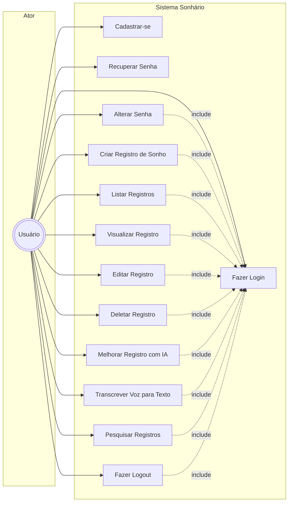

# Diagrama de Caso de Uso - Sonhário

## Descrição dos Casos de Uso

### Casos de Uso de Autenticação

1. **Cadastrar-se**
   - Permite que um novo usuário crie uma conta no sistema
   - Requer nome, e-mail e senha

2. **Fazer Login**
   - Autentica o usuário no sistema usando e-mail e senha
   - Gera um token JWT para sessão autenticada
   - Pré-requisito para a maioria dos casos de uso

3. **Recuperar Senha**
   - Permite que o usuário solicite uma nova senha via e-mail
   - Não requer autenticação prévia

4. **Alterar Senha**
   - Permite que o usuário autenticado altere sua senha
   - Requer a senha atual e a nova senha

5. **Fazer Logout**
   - Encerra a sessão do usuário
   - Limpa os dados armazenados localmente

### Casos de Uso de Registros de Sonhos

6. **Criar Registro de Sonho**
   - Permite que o usuário crie um novo registro de sonho
   - Pode usar transcrição de voz ou texto manual

7. **Listar Registros**
   - Exibe todos os registros de sonhos do usuário
   - Ordenados por data de criação (mais recente primeiro)

8. **Visualizar Registro**
   - Mostra o conteúdo completo de um registro selecionado

9. **Editar Registro**
   - Permite alterar o conteúdo de um registro existente
   - Registra a data da alteração

10. **Deletar Registro**
    - Remove permanentemente um registro
    - Requer confirmação do usuário

11. **Melhorar Registro com IA**
    - Usa inteligência artificial para melhorar a descrição do sonho
    - Requer que o registro tenha pelo menos 5 caracteres

12. **Transcrever Voz para Texto**
    - Converte fala em texto para facilitar a criação/edição de registros
    - Suporta pausa e retomada da gravação

13. **Pesquisar Registros**
    - Permite buscar registros por termos específicos
    - Busca case-insensitive e ignora acentos

## Relacionamentos

- Os casos de uso de **4 a 13** incluem o caso de uso **Fazer Login**, ou seja, requerem que o usuário esteja autenticado.
