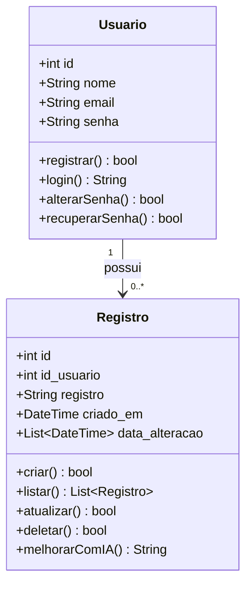

# Diagrama de Classes - Sonhário

## Descrição das Classes

### Usuario

Representa um usuário do sistema Sonhário.

**Atributos:**

- `id`: Identificador único do usuário (chave primária)
- `nome`: Nome completo do usuário
- `email`: E-mail do usuário (cláusula unique)
- `senha`: Senha do usuário (armazenada como hash criptografado)

**Métodos:**

- `registrar()`: Cria uma nova conta de usuário. Retorna sucesso ou falha.
- `login()`: Autentica o usuário e retorna o Token JWT de sessão.
- `alterarSenha()`: Altera a senha do usuário autenticado.
- `recuperarSenha()`: Gera um token temporário e envia o fluxo de recuperação por e-mail.

### Registro

Representa um registro de sonho de um usuário.

**Atributos:**

- `id`: Identificador único do registro (chave primária)
- `id_usuario`: Identificador do usuário proprietário do registro (chave estrangeira)
- `registro`: Conteúdo de texto do sonho
- `criado_em`: Data e hora exata da criação
- `data_alteracao`: Lista contendo o histórico de datas em que o registro sofreu modificações

**Métodos:**

- `criar()`: Salva um novo sonho no banco de dados.
- `listar()`: Busca e retorna a lista de todos os registros do usuário conectado.
- `atualizar()`: Modifica o texto de um registro e insere a data atual na lista `data_alteracao`.
- `deletar()`: Remove permanentemente ou desativa o registro.
- `melhorarComIA()`: Envia o texto atual para a API de IA e retorna o texto aprimorado estruturado.

## Relacionamento

Um **Usuario** pode possuir zero ou muitos **Registro**s (relação de 1 para N).
